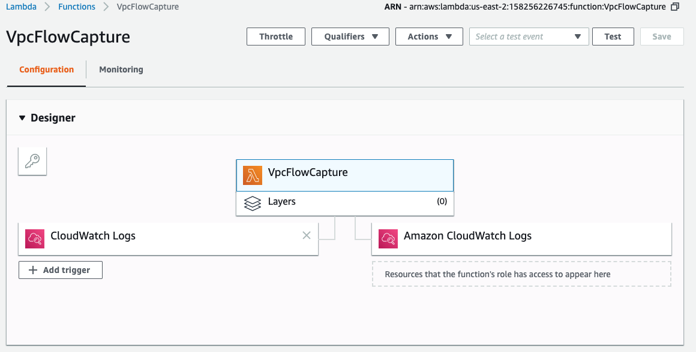
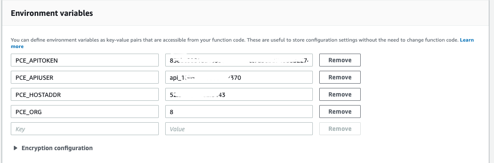

For our Lambda function to work, we would need the programming capabilities of Illumio ASP and AWS. Lets go over the configuration needed for both Illumio and AWS
 
1. Illumio
   1. We would need API credentials from Illumio ASP for the Lambda function to make the REST API call. 
   1. You could get this information from the PCE UI. Follow the below steps to generate the credentials for the Lambda function. 
   1. We will need this credential later when we create the AWS lambda function
      1. Login to PCE web UI.
      1. From top right, click your login name.
      1. Click My API Keys.
      1. Click Add from the top.
      1. Fill in the form and click save to generate the credentials.
      1. Download the credentials as this is the only time you will be able to download the credentials.
1. We will create an Illumio Unmanaged workload for every EC2 instance we would like to visualize the flow for. 
You could look for the steps to create unmanaged workload from Illumio ASP “PCE Web Console Users Guide”. 
Link to documentation page herehttps://support.illumio.com/public/documentation/index.html

1. AWS Cloud
   1. CloudWatch console
      1. Create a Log Group

   1. Lambda console
      1. Create a Lambda function from the AWS Lambda console and Add trigger by configuring a CloudWatch log created in 1.a above. 
      1. An example configuration is shown in 3 below.
      
                      
      
      1. Copy the function code from the GitHub src directory of this repository.
      1. Create the 4 environment variables seen in the image below with the credentials we created in section A.1 under Illumio at the beginning.
      
         
   
   1. VPC console 
      1. Create a flow log subscription for the VPC that you desire to visualize. 
      1. Please, select the destination as "Send to CloudWatch Logs" and enter the appropriate destination log group created in 1.a above and an IAM role.
