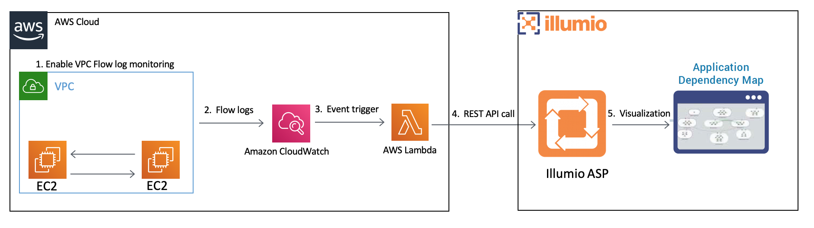

# Visualizing AWS EC2 Traffic flows with Illumio ASP using AWS Lambda Function

## Status 

IMPORTANT: This repository is no longer under active maintenance. If you are
interested in integrating an Illumio ASP with a cloud provider, please see Illumio
CloudSecure(https://www.illumio.com/products/cloudsecure).

**Project Description**

This repository contains a Lambda function that will  
1. Ingest VPC traffic flows and
1. Exports traffic flows to Illumio ASP.
Illumio ASP builds the Application Dependency Map that helps visualize the traffic between EC2 instances
and in understanding the application dependencies.

**Project Technology stack**

This project uses the AWS Lambda Ruby2.5 runtime

**Project workflow**

## Installation

Detailed instructions on how to install, configure, and get the project running are mentioned
in [INSTALL](INSTALL.md) document.

## Support

The AWS Lambda Function is released and distributed as open source software subject to the [LICENSE](LICENSE).
Illumio has no obligation or responsibility related to the AWS Lambda Function with respect to support, maintenance, availability, security or otherwise.
Please read the entire [LICENSE](LICENSE) for additional information regarding the permissions and limitations.
You can engage with the author & contributors team and community on SLACK.

## Help or Docs

If you have questions, please use slack for asking them.
If you have issues, bug reports, etc, please file an issue in this repository's Issue Tracker.

## Contributing

Instructions on how to contribute:  [CONTRIBUTING](CONTRIBUTING.md).

## Links

 * Screencast demonstrating the project https://labs.illumio.com/demystify-aws-cloud-workload-security-by-visualizing-connectivity-and-security-policy
 * Illumio documentation page for configuring Illumio ASP https://support.illumio.com/public/documentation/index.html
